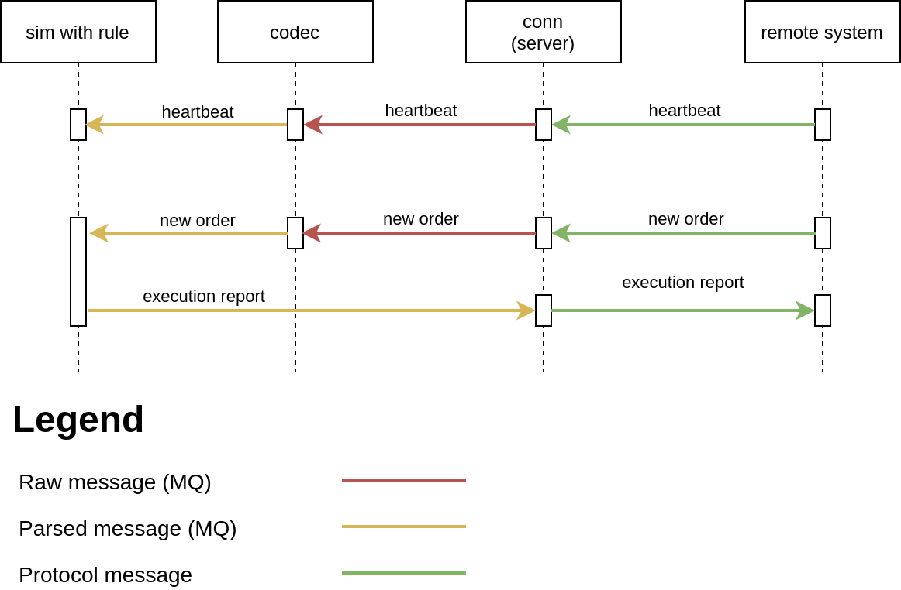

# Overview
This project demonstrates how to organize your project with custom rules for [th2-sim](https://github.com/th2-net/th2-sim).

This project implemented gRPC API, which is described in [th2-grpc-sim-template](https://github.com/th2-net/th2-grpc-sim-template/blob/master/src/main/proto/th2_grpc_sim_template/sim_template.proto "sim_template.proto")

Fork this project and follow instructions to start your custom project
## How to use
1. Fork [th2-grpc-sim-template](https://github.com/th2-net/th2-grpc-sim-template) project and edit proto files if needed.
1. Edit dependencies in ``build.gradle`` file to include all the required libraries with generated gRPC sources. 
1. Edit ``rootProject.name`` variable in ``settings.gradle`` file.
1. Edit services classes and their methods
1. Edit [services file](https://github.com/th2-net/th2-sim-template/blob/master/src/main/resources/META-INF/services/com.exactpro.th2.sim.ISimulatorPart "com.exactpro.th2.sim.ISimulatorPart") in ``META-INF`` if needed 
## Rules

Rules consists of two methods:
1. ``checkTriggered`` - it is used for checking if rule will generate the messages
1. ``handle`` or ``handleTriggered`` - it is used for generating outgoing messages

Rules can also use arguments. In order to do this you should use constructor in your custom class.

The rules are divided into 3 types and the only difference between them is the login method for ``checkTriggered``:
1. Compare rule ([Example](https://github.com/th2-net/th2-sim-template/blob/master/src/main/kotlin/com/exactpro/th2/sim/template/rule/TemplateAbstractRule.kt "TemplateAbstractRule.kt"))
1. Predicate rule ([Example](https://github.com/th2-net/th2-sim-template/blob/master/src/main/kotlin/com/exactpro/th2/sim/template/rule/TemplatePredicateRule.kt "TemplatePredicateRule.kt"))
1. Abstract rule ([Example](https://github.com/th2-net/th2-sim-template/blob/master/src/main/kotlin/com/exactpro/th2/sim/template/rule/TemplateFixRule.kt "TemplateFixRule.kt"))

### Compare rule
This type contains the most simple logic for check. 
The rules of this type will be triggered only if the message type and the fields from the incoming message are equals to the values that we had set in the rule.

### Predicate rule
This type contains the most flexible check conditions. 
The rules of this type will only be triggered if the message type and the message fields logical functions, which are set in rule, return a true value. 
The logical functions of the fields in this rule are isolated between each other.

### Abstract rule
This type contains the most flexible check conditions. The rules of this type will be triggered if your custom logic in method ``checkTriggered`` will return a value equal to true.

## Service
If you want to add the possibility of creating a rule via gRPC you should edit [th2-grpc-sim-template](https://github.com/th2-net/th2-grpc-sim-template/blob/master/src/main/proto/th2_grpc_sim_template/sim_template.proto "sim_template.proto") and class [TemplateService](https://github.com/th2-net/th2-sim-template/blob/master/src/main/kotlin/com/exactpro/th2/sim/template/service/TemplateService.kt "TemplateService.kt").
For adding a rule to simulator you can use the utility method ``ServiceUtils.addRule`` or the method from ``Simulator`` class with the name ``addRule``. On the gRPC request you should return ``RuleID``.

## Work example

On the picture is presented an example of simulator work with the rule ``TemplateFixRule`` enabled. This rule sends an ``ExecutionReport`` message if the income message is a ``NewOrderSingle``.
If the income message is wrong (not ``NewOrderSingle``), the rule in simulator will not generate an outgoing message. 
If the income message is correct (``NewOrderSingle``), the rule will generate one ``ExecutionReport``.

## Release notes

### 3.2.0

+ Update th2-sim to version 3.7.0
+ Update th2-common to version 3.19.0